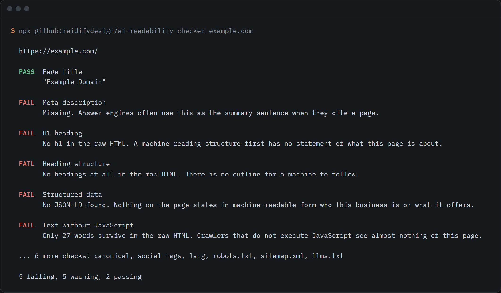

# AI Readability Checker

[](LICENSE)
[](package.json)
[](package.json)

Reads the **raw HTML** of any public URL, the version a crawler sees before JavaScript runs, and reports what a machine can and cannot understand about the page.

```bash
npx github:reidifydesign/ai-readability-checker example.com
```



Not a score out of 100. Every finding names what was found and why it matters to a machine reader, and nothing is inferred beyond the bytes.

Live version: <https://reidify.design/ai-readability-checker>

## Why raw HTML

Google renders JavaScript reliably. Many AI crawlers do not.

Vercel instrumented AI crawler traffic across its network and found the crawlers behind ChatGPT and Claude request JavaScript files, ChatGPT on 11.50% of requests and Claude on 23.84%, then never execute them. In their words: *"They don't execute them. They can't read client-side rendered content."*

Google's own documentation says the same thing from the other side:

> "Server-side or pre-rendering is still a great idea because it makes your website faster for users and crawlers, and not all bots can run JavaScript."

So if your meaning only exists after hydration, a large part of your machine audience never receives it. This tool shows you that gap.

## The check this tool most needed, added 22 Aug 2026

For about four months, all 123 pages of reidify.design served their entire contents inside a hidden `div`, after the footer, with nothing able to reveal it.

One Suspense boundary above the route tree made React take its streaming path during prerender: fallback inside `main`, real page in a hidden `div`, then a small inline script to move the content into place. The Content Security Policy is `script-src self` plus hashes, so that inline script never survived into the built file.

A build check had been running the whole time. It counted characters inside the root element and passed happily, because **hidden characters are still characters**.

This tool had the same blind spot until now. It counted words in stripped HTML, which counts hidden words too. It now finds text that is present but never rendered, subtracts it before counting, and reports both numbers. On the failure above it reports 500 words hidden and 1 word visible, which is what the machine actually saw.

Detection is depth-tracked rather than regex-matched, because a non-greedy regex closes on the first nested `</div>` and reports a fraction of the real blob.

## Command line

```bash
npx github:reidifydesign/ai-readability-checker example.com
npx github:reidifydesign/ai-readability-checker https://example.com --json
```

Exits `1` if any check fails. Warnings do not fail the run, because a warning is a judgement call and a build should not break on one.

## What it checks

**On the page**
- Title and meta description
- `h1` presence and count
- Heading tree, including skipped levels
- JSON-LD structured data, and whether any of it names the entity
- **Text hidden from rendering**, inside `hidden`, `display:none` or `<template>`
- How much text survives before any JavaScript runs, with hidden content subtracted first
- Image `alt` coverage
- Canonical URL
- Open Graph tags
- `lang` declaration

**Across the site**
- `robots.txt`, specifically whether GPTBot, ClaudeBot, PerplexityBot and Google-Extended are named, and whether they are allowed or blocked
- Sitemap reference, and a valid `sitemap.xml`
- `llms.txt` presence, reported honestly as optional since Google has stated it does not use it

## Usage

The core is a single dependency-free module exporting a standard `(Request) => Response` handler, so it runs on Netlify Functions, Cloudflare Workers, Deno, Bun, or any Node 18+ runtime with `fetch`.

```js
import handler from './src/check.js';

const res = await handler(
  new Request('https://example.com/check', {
    method: 'POST',
    headers: { 'Content-Type': 'application/json' },
    body: JSON.stringify({ url: 'example.com' }),
  }),
  {}
);

console.log(await res.json());
```

Or run the included example:

```bash
node example.js stripe.com
```

### Response shape

```jsonc
{
  "url": "https://example.com/",
  "title": "Example Domain",
  "checkedAt": "2026-07-31T00:00:00.000Z",
  "counts": { "pass": 5, "warn": 4, "fail": 3, "info": 1 },
  "page": [
    { "id": "title", "label": "Page title", "status": "pass", "detail": "\"Example Domain\"" }
  ],
  "site": [
    { "id": "robots", "label": "robots.txt", "status": "warn", "detail": "No robots.txt found." }
  ]
}
```

`status` is one of `pass`, `warn`, `fail`, `info`.

## Safety

This fetches arbitrary user-supplied URLs, so it is built defensively:

- **SSRF guard.** Blocks `localhost`, `.internal`, and the private ranges `127.*`, `10.*`, `192.168.*`, `169.254.*`, `172.16-31.*`, and IPv6 loopback. Hostnames without a dot are rejected.
- **Timeout.** 10 seconds per fetch, via `AbortController`.
- **Response cap.** 2 MB, truncated rather than buffered whole.
- **Rate limit.** In-memory, per instance, 12 requests per minute per IP. Best effort; put a real limiter in front for production.
- **Honest user agent.** It identifies itself and links back. It does not pretend to be a browser or a search crawler.
- **Stores nothing.** No database, and submitted URLs are never logged.

## Known limits

- Rate limiting is per instance and resets on cold start. Fine for a public tool, not a substitute for edge rate limiting.
- The heading-tree check reads source order, which is usually but not always visual order.
- Sites behind bot protection will fail to fetch. That is itself a useful signal, and the tool says so rather than guessing.
- It reports what crawlers *can* read. It cannot tell you whether they will *prefer* you over a competitor they can also read. That takes proof, consistency and authority, not markup.

## Licence

MIT. Built by [@rishsadh](https://github.com/rishsadh) at [Reidify](https://reidify.design), an AI-first design and systems studio in Mumbai.
